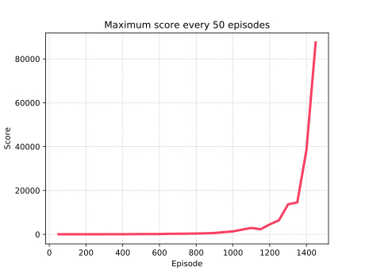

# tetris-ai

A bot that plays [Tetris](https://en.wikipedia.org/wiki/Tetris) using deep reinforcement learning.

## Demo

First 10000 points, after some training.


## Requirements

- Tensorflow/Jax/PyTorch
- Tensorboard
- Keras
- Opencv-python
- Numpy
- Pillow
- Tqdm

The original tests were evaluated using Keras with Tensorflow as the backend. However, new tests (`keras==3.5.0`) using Jax (`jax[cuda12]`) as the backend appear to result in faster training/predict operations (e.g., `KERAS_BACKEND="jax" python3 run.py`).

## Run

- Train/execute:
```shell
# hyper parameters can be changed in the run.py script
python3 run.py
```

- View logs with `tensorboard`:
```shell
tensorboard --logdir ./logs
```

- Play a game with an existing model (`sample.keras` is a previously trained model that achieved more than 800k points, using 3 Relu layers with 32 neurons each):
```shell
python3 run_model.py sample.keras
```


## How does it work

#### Reinforcement Learning

At first, the agent will play random moves, saving the states and the given reward in a limited queue (replay memory). At the end of each episode (game), the agent will train itself (using a neural network) with a random sample of the replay memory. As more and more games are played, the agent becomes smarter, achieving higher and higher scores.

Since in reinforcement learning once an agent discovers a good 'path' it will stick with it, it was also considered an exploration variable (that decreases over time), so that the agent picks sometimes a random action instead of the one it considers the best. This way, it can discover new 'paths' to achieve higher scores.


#### Training

The training is based on the [Q Learning algorithm](https://en.wikipedia.org/wiki/Q-learning). Instead of using just the current state and reward obtained to train the network, it is used Q Learning (that considers the transition from the current state to the future one) to find out what is the best possible score of all the given states **considering the future rewards**, i.e., the algorithm is not greedy. This allows for the agent to take some moves that might not give an immediate reward, so it can get a bigger one later on (e.g. waiting to clear multiple lines instead of a single one).

The neural network will be updated with the given data (considering a play with reward *reward* that moves from *state* to *next_state*, the latter having an expected value of *Q_next_state*, found using the prediction from the neural network):

if not terminal state (last round): *Q_state* = *reward* + *discount* × *Q_next_state*
else: *Q_state* = *reward*


#### Best Action

Most of the deep Q Learning strategies used output a vector of values for a certain state. Each position of the vector maps to some action (ex: left, right, ...), and the position with the higher value is selected.

However, the strategy implemented was slightly different. For some round of Tetris, the states for all the possible moves will be collected. Each state will be inserted in the neural network, to predict the score obtained. The action whose state outputs the biggest value will be played.


#### Game State

It was considered several attributes to train the network. Since there were many, after several tests, a conclusion was reached that only the first four present were necessary to train:

- **Number of lines cleared**
- **Number of holes**
- **Bumpiness** (sum of the difference between heights of adjacent pairs of columns)
- **Total Height**
- Max height
- Min height
- Max bumpiness
- Next piece
- Current piece


#### Game Score

Each block placed yields 1 point. When clearing lines, the given score is $number\_lines\_cleared^2 \times board\_width$. Losing a game subtracts 1 point.


## Implementation

The code was implemented using `Python`. For the neural network, it was used the framework `Keras`.

#### Internal Structure

The agent is formed by a deep neural network, with variable number of layers, neurons per layer, activation functions, loss function, optimizer, etc. It was chosen a neural network with 2 hidden layers (32 neurons each); the activations `ReLu` for the inner layers and the `Linear` for the last one; `Mean Squared Error` as the loss function; `Adam` as the optimizer; `Epsilon` (exploration) starting at 1 and ending at 0, when the number of episodes reaches 75%; `Discount` at 0.95 (significance given to the future rewards, instead of the immediate ones).

#### Training

For the training, the replay queue had size 20000, with a random sample of 512 selected for training each episode, using 1 epoch.


## Results

For 2000 episodes, with epsilon ending at 1500, the agent kept going for too long around episode 1460, so it had to be terminated. Here is a chart with the maximum score every 50 episodes, until episode 1450:



Note: Decreasing the `epsilon_end_episode` could make the agent achieve better results in a smaller number of episodes.


## Useful Links

#### Deep Q Learning
- PythonProgramming - https://pythonprogramming.net/q-learning-reinforcement-learning-python-tutorial/
- Keon - https://keon.io/deep-q-learning/
- Towards Data Science - https://towardsdatascience.com/self-learning-ai-agents-part-ii-deep-q-learning-b5ac60c3f47

#### Tetris
- Code My Road - https://codemyroad.wordpress.com/2013/04/14/tetris-ai-the-near-perfect-player/ (uses evolutionary strategies)